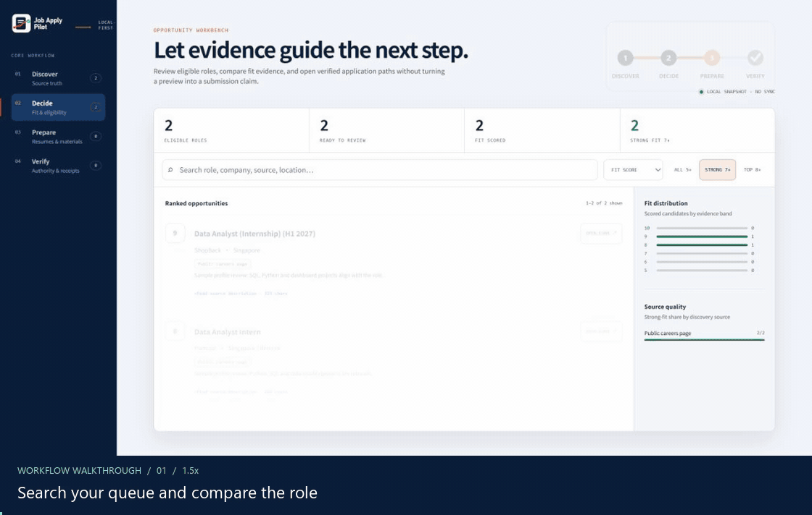
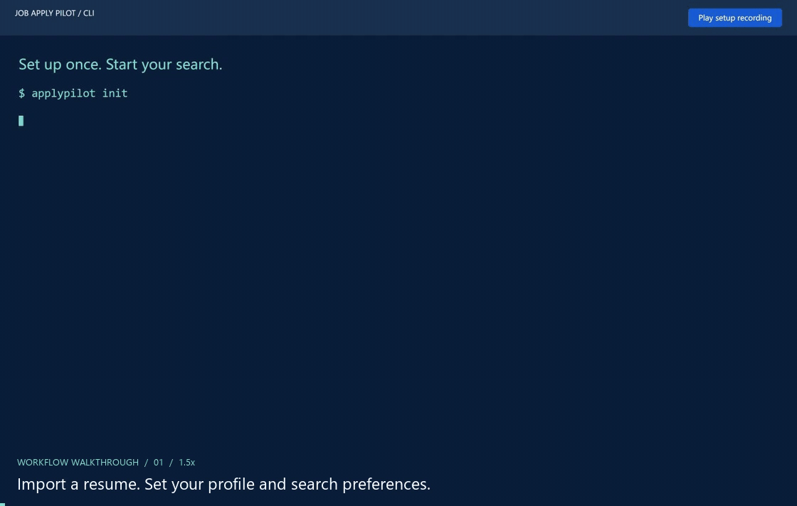
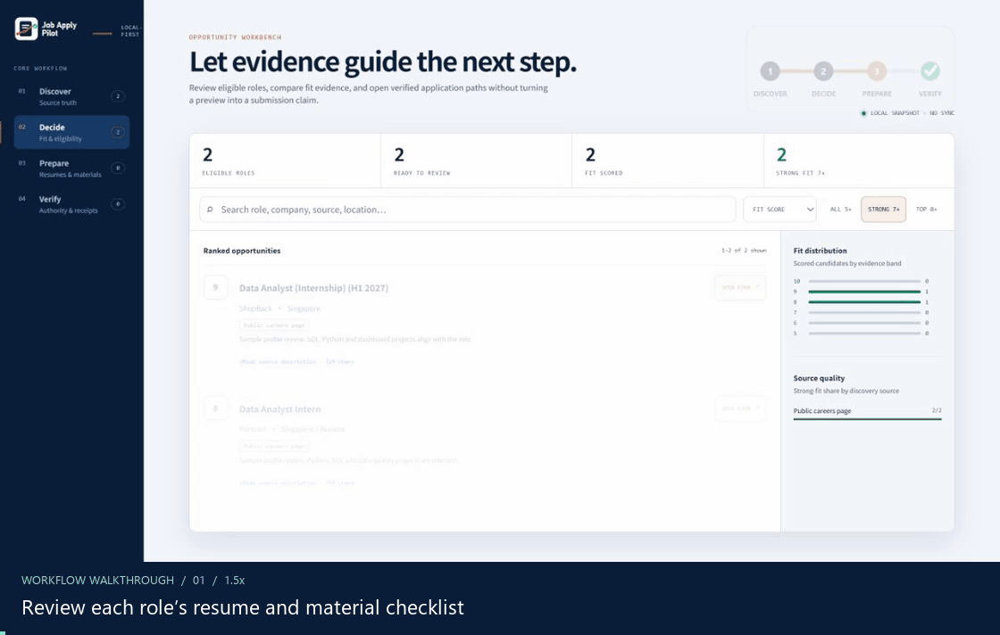
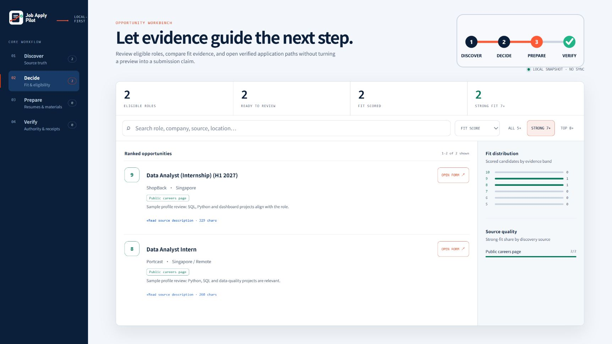

# Job Apply Pilot

[](https://github.com/raederhans/AutoJobApply/releases/latest)
[](https://github.com/raederhans/AutoJobApply/actions/workflows/ci.yml)
[](pyproject.toml)
[](LICENSE)

[English](README.md) | [简体中文](README.zh-CN.md)

**Find jobs, prepare your resume, fill applications, and track the results — in one local workflow.**

Job Apply Pilot is an open-source job-search assistant. It discovers and ranks opportunities, tailors resumes and cover letters, and uses Codex or Claude browser agents to work through applications. Run tasks in the terminal and review your pipeline in a bilingual browser workbench.

## See it in action



*Search the workbench, inspect a real ShopBack vacancy, and prepare its application form in Codex’s browser. Candidate details and fit scores use sample data; the recording stops before submission.*

[Full-size workbench](docs/assets/demo/workbench-en.png) · [Reproduce the demo](docs/readme-demo.md) · [Getting started](docs/getting-started.md)

## Get started

**1. Install and set up once.** Use Python 3.11–3.12 for the full workflow, with `pipx` installed.

```bash
pipx install "git+https://github.com/raederhans/AutoJobApply.git@v0.7.0"
applypilot init
applypilot doctor
```

The wizard guides you through your resume, profile, search preferences, and AI configuration. Scoring and writing use your chosen LLM service. Browser applications use an authenticated Codex or Claude CLI and Edge, Chrome, or Chromium. `doctor` shows which components are ready and what to configure next.



*Selected steps replayed from a successful `applypilot init` run.*

**2. Find opportunities and open the workbench.**

```bash
applypilot radar collect
applypilot run enrich score
applypilot dashboard
```

Search and filter roles, compare fit, and inspect the job description and application link. Radar defaults target Singapore; adjust `searches.yaml` / `radar.yaml` in your workspace for your own market.

**3. Prepare materials and preview one application.**

```bash
applypilot run tailor cover pdf
applypilot apply --dry-run --url "https://employer.example/jobs/123"
```

Replace the example URL with a real role from your workbench. The first command prepares resumes, cover letters, and PDFs for eligible queued jobs; the second previews the selected application. When you are ready, follow the [review and submission steps](docs/getting-started.md#review-and-submit-one-job).



*Review the material checklist, then inspect an actual PDF generated by `applypilot run pdf`.*

## Your pipeline, at a glance



Run `applypilot dashboard` to open the local GUI:

| View | What you can explore |
| --- | --- |
| **Discover** | Job sources, collected opportunities, leads, and source health |
| **Decide** | Fit scores, matching reasons, search, sorting, and application links |
| **Prepare** | Resume versions, cover letters, material gaps, and routing decisions |
| **Verify** | Application history, execution status, action items, and receipts |

Switch between English and Chinese, filter your queue, and copy useful commands. The workbench is a read-only snapshot of your local data; run tasks in the CLI and regenerate it with `applypilot dashboard` to see updates.

## What you can do

- **Discover across sources.** Official careers pages and ATS feeds, optional job-board search, and imported leads.
- **Find your strongest matches.** Enrich descriptions and assess fit, eligibility, and application priority against your background.
- **Reuse and tailor materials.** Route an appropriate resume from your library, adapt it to the role, and generate cover letters and PDFs.
- **Work through applications.** Codex / Claude agents fill forms, upload materials, and navigate application steps, with preview and authorized submission modes.
- **Prepare multiple applications.** v0.7 adds concurrent preparation in Codex's in-app browser, with per-job progress. [Batch guide](docs/attended-runtime-batch.md)
- **Keep the history together.** Track jobs, materials, application attempts, receipts, and outstanding follow-ups.

## More ways to use it

| Task | Command / guide |
| --- | --- |
| Check your pipeline | `applypilot status` |
| Review recent discoveries | `applypilot radar report --hours 24` |
| Sync and inspect your resume library | `applypilot resume-library-sync` / `applypilot resume-library-status` |
| Choose a resume for one role | `applypilot resume-route --url "<job-url>"` |
| Add optional job-board connectors | [Installation options](docs/getting-started.md#installation-options) |
| Work inside Codex's in-app browser | [Browser worker guide](docs/visual-worker-bridge.md) |
| Explore all commands | `applypilot --help` |

## A few essentials

Review your information and materials before applying and follow each site's rules. Handle CAPTCHAs, identity checks, and assessments yourself. Keep personal workspaces, credentials, and browser sessions private. Online models receive the task content needed for their work and may charge according to your provider's plan.

## Development and credits

**v0.7.0 · Beta.** The product is **Job Apply Pilot**, the repository is **AutoJobApply**, and the command is `applypilot`.

```bash
python -m pip install -e ".[dev]"
ruff check src
pytest -q
```

[Changelog](CHANGELOG.md) · [Contributing](CONTRIBUTING.md) · [Security](SECURITY.md) · [Product notes](docs/product-core.md)

An independent continuation of [Pickle-Pixel/ApplyPilot](https://github.com/Pickle-Pixel/ApplyPilot), licensed under [AGPL-3.0-only](LICENSE). See [NOTICE.md](NOTICE.md) for upstream credits. Not affiliated with applypilot.app or useapplypilot.com.
