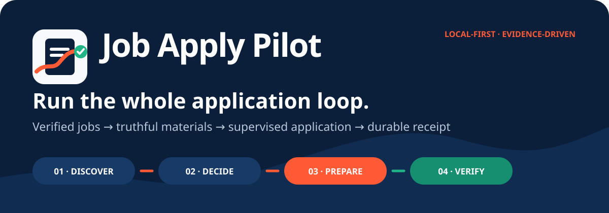

# Job Apply Pilot — local-first job application automation with proof

<p align="center">
  
</p>

[](https://github.com/raederhans/ApplyPilot/releases/latest)
[](https://github.com/raederhans/ApplyPilot/actions/workflows/ci.yml)
[](pyproject.toml)
[](LICENSE)

[English](README.md) | [简体中文](README.zh-CN.md)

**Find real jobs. Choose with evidence. Prepare truthful materials. Apply under your control. Prove what was submitted.**

Job Apply Pilot is a local-first operations workspace for the entire job-application loop. It combines official-source discovery, fit and eligibility review, evidence-backed resume routing, truthful tailoring, supervised browser assistance, application history, and receipt reconciliation in one auditable workflow.

It is built for people who want more leverage without surrendering judgment. Your profile, resumes, credentials, browser sessions, receipts, and runtime logs stay on your machine by default.

## What it actually does

| Need | Job Apply Pilot capability | Evidence boundary |
| --- | --- | --- |
| Find opportunities | Collect official openings, optional job-board results, and manually reviewed leads | A search result is not treated as a verified job |
| Choose what to pursue | Check eligibility, enrich job descriptions, score fit, and prioritize the queue | A high score is not permission to apply |
| Build the application | Route validated resumes, identify evidence gaps, tailor without inventing facts, and validate PDFs | Generated content is not automatically trusted |
| Work through the form | Prepare and fill supported application surfaces after explicit authorization | CAPTCHA, MFA, assessments, sensitive documents, and unsupported answers stop for review |
| Prove the outcome | Bind the exact job, authorization, browser observations, and receipt to one attempt | Clicking **Submit** is not proof that the employer received it |

## The workflow

```text
DISCOVER                 DECIDE                    PREPARE                    VERIFY
official jobs     →      eligibility       →      resume routing     →      exact-job receipt
board/manual leads       fit evidence              truthful tailoring        durable history
source state             readiness                 PDF + form prep            no blind retry
```

The guarded application path is:

```text
prepare → audit → authorize → submit → observe → reconcile receipt
```

If acceptance cannot be proved, the attempt remains `submission_uncertain`. Job Apply Pilot does not silently count it as success or automatically submit the same application again.

## Why this is not the original ApplyPilot

This repository is an independent continuation of [Pickle-Pixel/ApplyPilot](https://github.com/Pickle-Pixel/ApplyPilot), but its product contract is intentionally different.

| | Original ApplyPilot | Job Apply Pilot |
| --- | --- | --- |
| Product promise | High-volume autonomous application | Evidence-led, supervised application operations |
| Success model | Browser-driven submission | Exact-job receipt or an explicit uncertain state |
| Human role | Hands-off automation | Review and authorization at consequential boundaries |
| Data model | Pipeline output | Durable source, material, authorization, attempt, and receipt history |
| Privacy posture | Local open-source agent | Local-first workspace with no hosted account or cloud sync |
| Dashboard | Application progress | Read-only evidence workbench; no hidden writes or submissions |

The public product name is **Job Apply Pilot**. Compatibility identifiers remain unchanged: the CLI and Python package are `applypilot`, the distribution is `applypilot-local`, environment variables use `APPLYPILOT_*`, and the default workspace is `~/.applypilot/`.

This project is not affiliated with applypilot.app, useapplypilot.com, or other similarly named services.

## Current status

- **Beta, local-first, and CLI-first.** There is no hosted Job Apply Pilot service, account system, telemetry dashboard, or cloud sync.
- **End-to-end workflow available.** The source supports discovery, enrichment, scoring, resume-library routing, truthful tailoring, cover letters and PDF preparation, supervised application assistance, history, and receipt reconciliation.
- **Read-only browser dashboard.** The workbench presents Discover, Decide, Prepare, and Verify without mutating the database or executing commands.
- **Human review is a feature.** Unsupported claims, CAPTCHA or MFA, assessments, identity or financial documents, account recovery, security changes, and uncertain results remain explicit handoff points.
- **Current release: v0.5.2.** Existing commands, local data, and compatibility identifiers remain unchanged by this brand redesign.

## Install

Python 3.11 or 3.12 is recommended for the full workflow. Core commands and the official-source radar also support Python 3.13.

There is no `applypilot-local` release on PyPI. Install from the [latest GitHub release](https://github.com/raederhans/ApplyPilot/releases) or directly from this repository:

```bash
pipx install "git+https://github.com/raederhans/ApplyPilot.git@v0.5.2"
```

For a reproducible local deployment, download the release bundle and `SHA256SUMS`, verify the checksum, extract it, and run:

```bash
python install.py
```

Optional third-party job-board discovery is currently intended for Python 3.11–3.12:

```bash
python install.py --with-jobboards
```

## Quick start

Initialize the workspace, check capabilities, and open the read-only dashboard:

```bash
applypilot init
applypilot doctor
applypilot dashboard
```

Discover and prepare opportunities:

```bash
applypilot radar collect
applypilot radar report --hours 24
applypilot run discover enrich score tailor cover pdf
```

Review one exact job before any submission:

```bash
applypilot review-readiness
applypilot apply --dry-run --url <verified-job-url>
applypilot authorize-batch --url <verified-job-url>
applypilot apply --authorization-file <batch-manifest.json>
applypilot reconcile-receipts --file <receipt.json>
```

Inspect and route validated resume variants:

```bash
applypilot resume-library-sync
applypilot resume-library-status
applypilot resume-library-review
applypilot resume-route --url <verified-job-url>
```

Run `applypilot --help` for the full command list.

## Safety and local data

Do not commit or share the local workspace. It may contain profile data, resumes, generated documents, SQLite databases, API keys, browser profiles, screenshots, receipts, logs, or verification codes.

Job Apply Pilot does not endorse CAPTCHA bypass, hidden submission, identity-document automation, or account-recovery automation. See [SECURITY.md](SECURITY.md) before reporting a vulnerability.

## Development

```bash
python -m pip install -e ".[dev]"
ruff check src
pytest -q
python scripts/build_release.py
```

- [Product and frontend boundaries](docs/product-core.md)
- [Resume library curation](docs/resume-library-curation.md)
- [Company priority policy](docs/company-priority.md)
- [Changelog](CHANGELOG.md)
- [Contributing](CONTRIBUTING.md)
- [License and provenance](NOTICE.md)

Job Apply Pilot is licensed under [GNU AGPL-3.0-only](LICENSE). The original ApplyPilot authors retain copyright in the upstream work.
