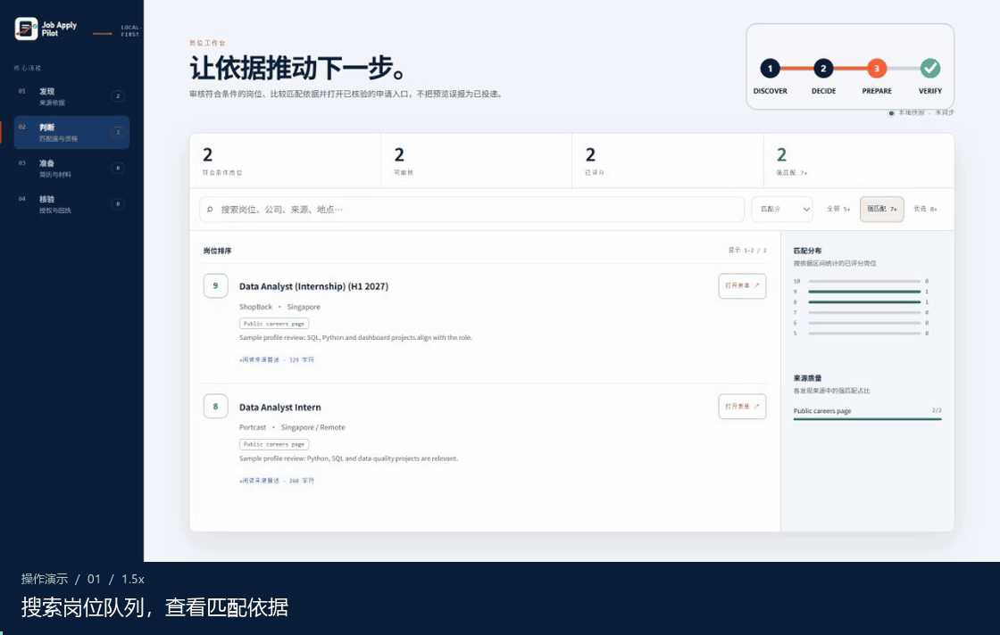
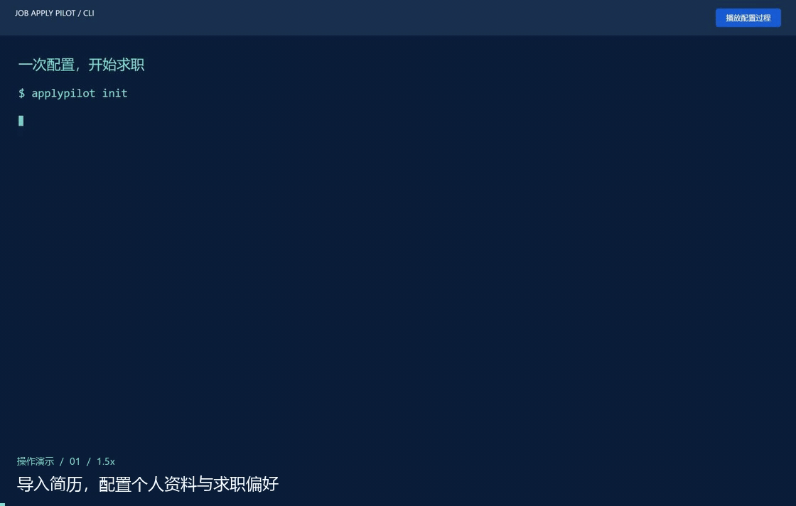
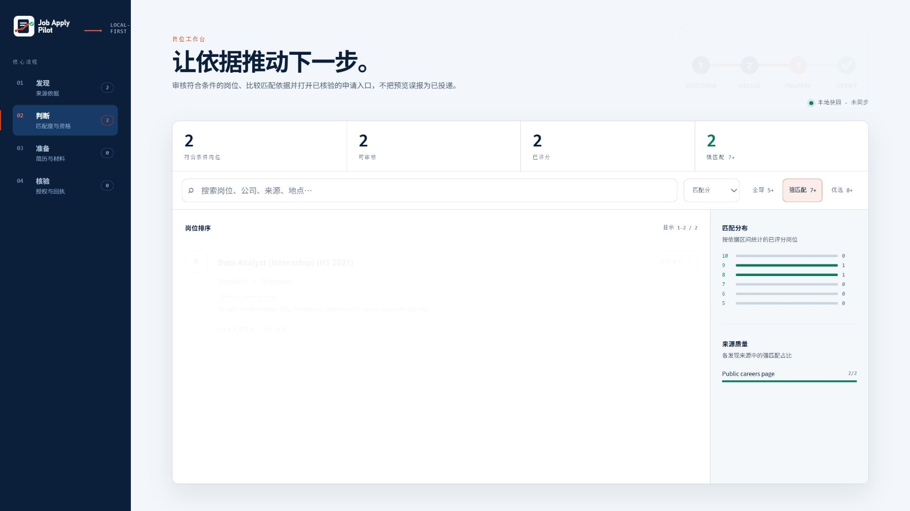

# Job Apply Pilot

[](https://github.com/raederhans/AutoJobApply/releases/latest)
[](https://github.com/raederhans/AutoJobApply/actions/workflows/ci.yml)
[](pyproject.toml)
[](LICENSE)

[English](README.md) | [简体中文](README.zh-CN.md)

**把找岗位、选简历、填申请和追踪结果，放进一个本地工作流。**

Job Apply Pilot 是一个开源求职助手：用 AI 发现和筛选岗位、定制简历与求职信，并通过 Codex 或 Claude 浏览器代理填写申请。你可以在终端运行任务，在中英文 GUI 工作台查看岗位、材料和申请进度。

## 先看它怎么工作



*在工作台搜索岗位，查看 ShopBack 的真实职位，并在 Codex 浏览器中准备申请表。候选人资料与匹配分使用示例数据，演示停在提交前。*

[查看工作台大图](docs/assets/demo/workbench-zh.png) · [演示复现说明](docs/readme-demo.md) · [完整上手指南](docs/getting-started.md)

## 开始使用

**1. 安装并完成一次配置。** 推荐 Python 3.11–3.12，并先安装 `pipx`。

```bash
pipx install "git+https://github.com/raederhans/AutoJobApply.git@v0.7.0"
applypilot init
applypilot doctor
```

初始化向导会引导你导入简历、填写个人资料和求职偏好、配置 AI。评分和材料生成需要一个 LLM 服务；浏览器投递需要已登录的 Codex 或 Claude CLI，以及 Edge、Chrome 或 Chromium。`doctor` 会列出已就绪与待配置的组件。



*回放一次成功运行的 `applypilot init` 关键步骤，配有中文引导；CLI 提示保留原文。*

**2. 找到岗位，打开工作台。**

```bash
applypilot radar collect
applypilot run enrich score
applypilot dashboard
```

在工作台里搜索岗位、按匹配度筛选，查看职位描述和申请入口。雷达默认配置面向新加坡；其他地区可在工作区的 `searches.yaml` / `radar.yaml` 调整。

**3. 准备材料，再预览一个申请。**

```bash
applypilot run tailor cover pdf
applypilot apply --dry-run --url "https://employer.example/jobs/123"
```

把示例地址替换为工作台中选定的真实岗位。前一条命令为符合条件的队列准备简历、求职信和 PDF；后一条运行该岗位的申请预览。审核完成后，按[上手指南中的投递步骤](docs/getting-started.md#review-and-submit-one-job)记录审核、授权并提交。


*检查材料清单，再查看 `applypilot run pdf` 实际生成的简历排版。*

## 一个工作台，查看整个申请流程



运行 `applypilot dashboard` 就能在浏览器打开本地 GUI：

| 页面 | 你可以看到什么 |
| --- | --- |
| **发现** | 岗位来源、收集结果、待跟进线索和来源状态 |
| **判断** | 岗位匹配分、匹配理由、搜索、排序和申请入口 |
| **准备** | 简历版本、求职信、材料缺口和简历路由结果 |
| **核验** | 申请历史、执行状态、待处理事项和回执 |

工作台支持中英文切换、筛选与命令复制。它以只读快照展示本地数据；执行任务使用 CLI，更新后重新运行 `applypilot dashboard` 即可刷新。

## 主要功能

- **多来源找岗**：官方招聘页面与 ATS、可选招聘平台搜索、手动导入线索。
- **AI 匹配与排序**：补全职位描述，结合个人背景评估匹配度、资格和申请优先级。
- **简历与求职信**：从简历库选择合适版本，按岗位定制内容，生成求职信和 PDF。
- **浏览器申请**：Codex / Claude 代理填写表单、上传材料、处理申请步骤；支持预览与授权投递。
- **多任务准备**：v0.7 支持在 Codex 内置浏览器中并行准备多个岗位，查看各任务进度。[使用说明](docs/attended-runtime-batch.md)
- **申请追踪**：保存岗位、材料、申请尝试及回执，集中跟进待处理事项。

## 更多用法

| 想做什么 | 命令 / 指南 |
| --- | --- |
| 查看当前进度 | `applypilot status` |
| 查看近期发现 | `applypilot radar report --hours 24` |
| 同步和检查简历库 | `applypilot resume-library-sync` / `applypilot resume-library-status` |
| 为一个岗位选择简历 | `applypilot resume-route --url "<job-url>"` |
| 安装可选招聘平台连接器 | [安装选项](docs/getting-started.md#installation-options) |
| 使用 Codex 内置浏览器执行任务 | [浏览器协作指南](docs/visual-worker-bridge.md) |
| 查看所有命令 | `applypilot --help` |

## 基本注意事项

投递前确认资料与材料准确，并遵守招聘网站规则；遇到验证码、身份验证或测评时由本人接手。个人资料、密钥和浏览器会话请保留在本机。使用在线模型时，相关任务内容会发送到你配置的服务，费用按该服务计。

## 开发与项目来源

当前版本 **v0.7.0 · Beta**。公开产品名为 **Job Apply Pilot**，仓库名为 **AutoJobApply**，CLI 命令为 `applypilot`。

```bash
python -m pip install -e ".[dev]"
ruff check src
pytest -q
```

[更新日志](CHANGELOG.md) · [贡献指南](CONTRIBUTING.md) · [安全问题](SECURITY.md) · [产品说明](docs/product-core.md)

本项目是 [Pickle-Pixel/ApplyPilot](https://github.com/Pickle-Pixel/ApplyPilot) 的独立延续项目，采用 [AGPL-3.0-only](LICENSE) 许可证。原作者版权与来源说明见 [NOTICE.md](NOTICE.md)。与 applypilot.app、useapplypilot.com 无关联。
